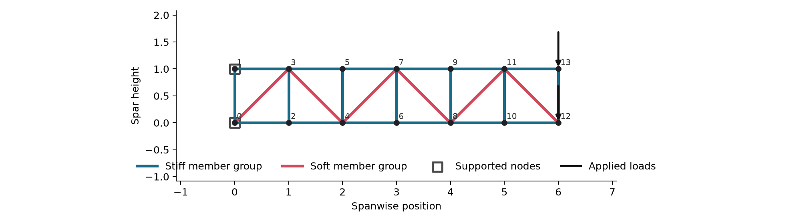
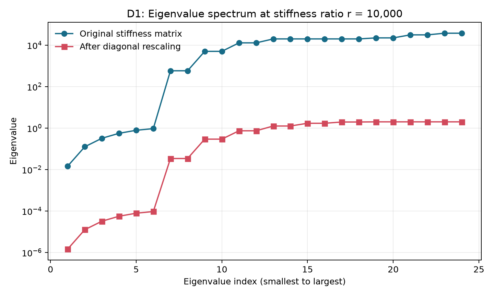
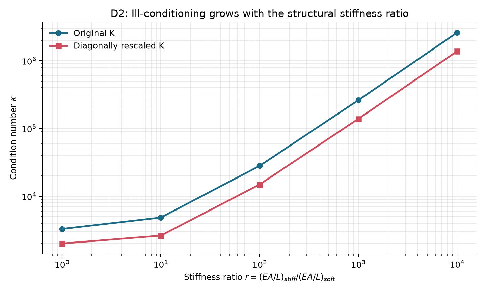
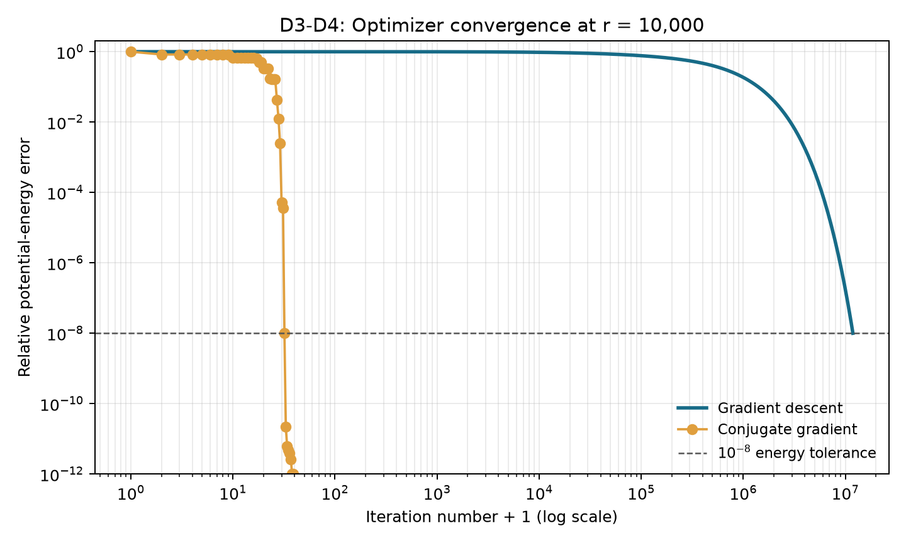
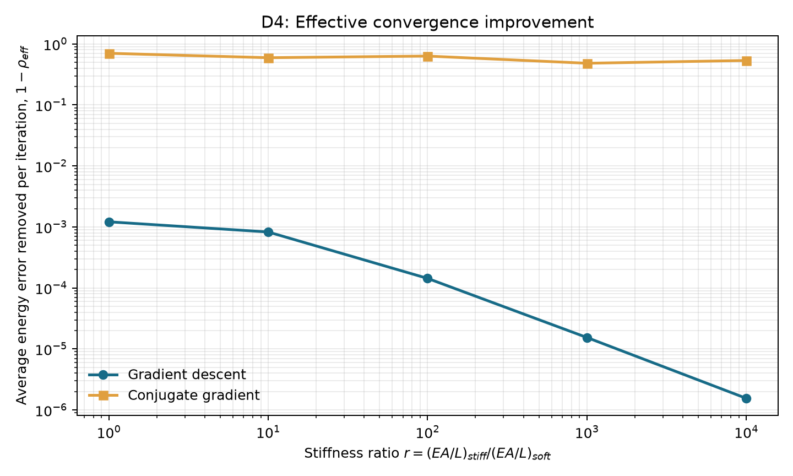
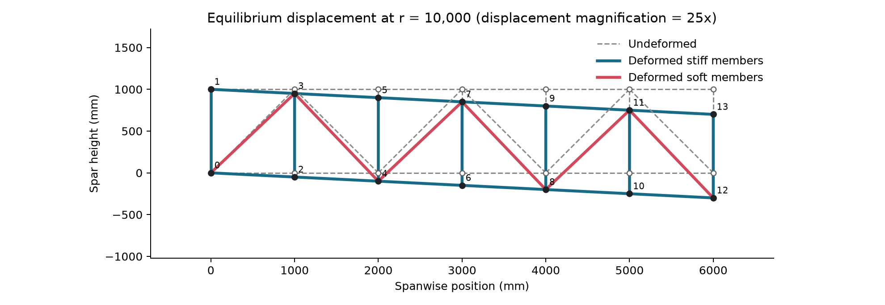

# Project 2: Ill-Conditioned Optimization in an Aircraft Spar Truss

**Team Optimus Prime**

This report studies a simplified aircraft spar as both a finite element analysis (FEA) problem and an optimization problem. The purpose is not to design a flight-ready spar. The purpose is to isolate one structural feature, a large difference between member stiffnesses, and show how it creates an ill-conditioned optimization problem.

The assignment requires four diagnostics: an eigenvalue spectrum and condition number (D1), evidence that the ill-conditioning is intrinsic (D2), its effect on a baseline method (D3), and a demonstrated solution (D4). The complete, commented implementation is in [`project2_truss.py`](project2_truss.py). The editable model data is in [`truss_config.py`](truss_config.py).

## 1. Problem identification and motivation

Aircraft spars carry bending and shear loads along a wing. A straight truss member has axial stiffness

$$
k=\frac{EA}{L},
$$

where $E$ is Young's modulus, $A$ is cross-sectional area, and $L$ is member length. Young's modulus measures how strongly a material resists elastic stretching. A large difference in $E$, $A$, or $L$ can create a large difference in member stiffness.

The documented example is a 2D Warren-style truss with 14 nodes. The upper and lower chords and the vertical posts form the **stiff member group**. The alternating diagonal braces form the **soft member group**. Both root nodes are fixed. A downward tip load is divided equally between the upper and lower tip nodes.



The model has two displacement components at each node: horizontal displacement and vertical displacement. Fixing both components at the two root nodes leaves 24 unknown displacement values.

The model is configurable. A student edits four readable lists in `truss_config.py`:

- `NODES = [(x, y), ...]` gives node coordinates.
- `MEMBERS = [(node_i, node_j, group), ...]` gives connections and assigns each member to the `"soft"` or `"stiff"` group.
- `SUPPORTS = [(node, fix_x, fix_y), ...]` identifies fixed displacement components.
- `LOADS = [(node, force_x, force_y), ...]` gives applied nodal forces.

Node numbers are zero-based list positions. For example, node 0 is the first coordinate in `NODES`. A 7-to-14-node model is recommended for a manually traced picture because it preserves the main load paths without requiring the user to enter and debug approximately 100 nodes and many more connections. The stiffness matrix is assembled from these structural inputs. The user does not enter the stiffness matrix directly.

## 2. Mathematical formulation

### 2.1 Decision variables and parameters

The decision variable is

$$
u=[u_{1x},u_{1y},u_{2x},u_{2y},\ldots]^T,
$$

the vector of unknown nodal displacements after fixed displacement values are removed. A **decision variable** is a value selected by the optimization problem. The member stiffnesses and applied loads are model parameters in this study; they are not decision variables.

### 2.2 Truss finite element

Each ideal truss member carries axial force only. For a member joining nodes $i$ and $j$, define

$$
c=\frac{x_j-x_i}{L}, \qquad s=\frac{y_j-y_i}{L}.
$$

The values $c$ and $s$ describe the member direction. Its stiffness matrix in global horizontal and vertical coordinates is

$$
K_e=k
\begin{bmatrix}
c^2 & cs & -c^2 & -cs\\
cs & s^2 & -cs & -s^2\\
-c^2 & -cs & c^2 & cs\\
-cs & -s^2 & cs & s^2
\end{bmatrix}.
$$

The implementation uses $k_{\text{soft}}=1$ and $k_{\text{stiff}}=r$. Thus the specified group ratio is exact even when members have different lengths. Physically, this means the value of $EA$ for each member is selected so that $EA/L$ equals its assigned $k$.

The **global stiffness matrix** $K$ is assembled by adding each $K_e$ to the rows and columns for the member's four displacement components. Degree of freedom $2i$ is the horizontal displacement of node $i$, and degree of freedom $2i+1$ is its vertical displacement. Removing the rows and columns for fixed displacements applies the support conditions.

### 2.3 Minimum-potential-energy problem

The equilibrium displacement minimizes potential energy:

$$
\min_u \Pi(u)=\frac{1}{2}u^T K u-f^T u,
$$

where $f$ is the reduced load vector. The **potential energy** $\Pi(u)$ is a function of displacement. It equals the strain energy stored in the members minus the work done by the applied loads.

The gradient and Hessian are

$$
\nabla \Pi(u)=Ku-f, \qquad \nabla^2\Pi(u)=K.
$$

The **gradient** gives the slope with respect to every displacement. The **Hessian** is the matrix of second derivatives. Here the Hessian is the stiffness matrix. Setting the gradient to zero gives the equilibrium equation

$$
Ku^\star=f.
$$

The assembled matrix is symmetric because every element matrix is symmetric. The reduced matrix is **positive definite** when every nonzero free deformation stretches at least one member. In symbols, $x^TKx>0$ for every nonzero vector $x$. The code checks this condition by verifying that every eigenvalue is positive. Positive definiteness is not automatic: missing members or insufficient supports can leave a mechanism with a zero eigenvalue. A correct elastic truss stiffness matrix is not negative definite because elastic strain energy cannot be negative.

## 3. Ill-conditioning mechanism

The structural control value is

$$
r=\frac{k_{\max}}{k_{\min}}
=\frac{k_{\text{stiff}}}{k_{\text{soft}}}.
$$

The tested values are $r=1,10,100,1000,10000$. An **eigenvalue** of $K$ measures stiffness in one independent deformation direction. The **condition number** is

$$
\kappa(K)=\frac{\lambda_{\max}(K)}{\lambda_{\min}(K)}.
$$

A large condition number means that the potential-energy surface is steep in some directions and shallow in others. This stretched shape is called **ill-conditioned**.

The matrix can be written as

$$
K(r)=rK_{\text{stiff}}+K_{\text{soft}}.
$$

The largest eigenvalue grows with $r$ because some deformations stretch stiff members. The stiff chords and vertical posts alone also have shear-like mechanism directions. The soft diagonals provide the main resistance in those directions. Therefore, the smallest and largest eigenvalues do not grow at the same rate, so the condition number increases with $r$.

### D1: Eigenvalue spectrum



At $r=10{,}000$, the original condition number is $2.60\times10^6$. The separated small and large eigenvalues show that the structure has deformation directions with very different stiffnesses.

### D2: Intrinsic test using diagonal rescaling

Define

$$
D=\operatorname{diag}(K), \qquad S=D^{-1/2}, \qquad \widehat K=SKS.
$$

This **Jacobi rescaling** gives every displacement coordinate a unit diagonal stiffness. It tests whether the large condition number is caused only by different coordinate scales.



| $r$ | $\kappa(K)$ | $\kappa(\widehat K)$ |
|---:|---:|---:|
| 1 | $3.30\times10^3$ | $2.01\times10^3$ |
| 10 | $4.86\times10^3$ | $2.63\times10^3$ |
| 100 | $2.81\times10^4$ | $1.49\times10^4$ |
| 1,000 | $2.62\times10^5$ | $1.39\times10^5$ |
| 10,000 | $2.60\times10^6$ | $1.38\times10^6$ |

The rescaled condition number remains large and still grows by more than two orders of magnitude. Therefore, unequal coordinate scales are not the only cause. The soft members control real structural deformation directions, so the ill-conditioning is intrinsic to this member-group model.

## 4. Effect on gradient descent

Gradient descent uses the negative gradient as its search direction:

$$
u_{k+1}=u_k-\alpha(Ku_k-f).
$$

The implementation starts from $u_0=0$ and uses

$$
\alpha=\frac{2}{\lambda_{\max}+\lambda_{\min}},
$$

the best fixed step size based on the two extreme eigenvalues. The common convergence measure is the relative potential-energy error

$$
E_k=\frac{\Pi(u_k)-\Pi(u^\star)}
{\Pi(u_0)-\Pi(u^\star)}.
$$

The target is $E_k\leq10^{-8}$. The gradient-descent recurrence is evaluated exactly in the eigenvector basis. This gives the same mathematical iterates as a step-by-step loop but avoids millions of slow Python loop operations.

| $r$ | Gradient descent iterations to $10^{-8}$ |
|---:|---:|
| 1 | 15,168 |
| 10 | 22,272 |
| 100 | 128,397 |
| 1,000 | 1,195,856 |
| 10,000 | 11,871,364 |

The iteration count increases by nearly three orders of magnitude. Gradient descent repeatedly corrects coupled stiff and soft deformation directions, so a large condition number makes progress very slow.

## 5. Proposed solution and D4 demonstration

The proposed solution is the conjugate gradient method (CG). It applies to symmetric positive definite systems. Traditional CG starts with residual $r_0=f-Ku_0$ and search direction $p_0=r_0$. It then uses

$$
\alpha_k=\frac{r_k^Tr_k}{p_k^TKp_k},
$$

$$
u_{k+1}=u_k+\alpha_kp_k,
$$

$$
r_{k+1}=r_k-\alpha_kKp_k,
$$

$$
\beta_k=\frac{r_{k+1}^Tr_{k+1}}{r_k^Tr_k},
\qquad
p_{k+1}=r_{k+1}+\beta_kp_k.
$$

CG search directions are **$K$-conjugate**, which means $p_i^TKp_j=0$ for two different directions. This is orthogonality measured using the energy curvature $K$. Therefore, exact minimization along a new direction does not undo the completed minimization along an earlier direction.

Both gradient descent and CG solve the original system $Ku=f$. Jacobi rescaling is not used in either optimizer. It appears only in D2 because the project requires the intrinsic-condition-number test. This separation makes the D4 comparison answer one clear question: how much do conjugate search directions improve convergence on the same ill-conditioned problem?

### D4 before-and-after convergence evidence



| $r$ | GD iterations | CG iterations | Iteration speedup |
|---:|---:|---:|---:|
| 1 | 15,168 | 24 | 632 |
| 10 | 22,272 | 24 | 928 |
| 100 | 128,397 | 26 | 4,938 |
| 1,000 | 1,195,856 | 28 | 42,709 |
| 10,000 | 11,871,364 | 32 | 370,980 |

At $r=10{,}000$, gradient descent requires 11,871,364 iterations, while CG requires 32 iterations on the same $K$ and $f$. This is an iteration speedup of approximately 370,980. CG does not change $K$ or $\kappa(K)$; it improves the effective convergence rate by using $K$-conjugate directions.

Define the observed effective rate at the first iteration $k$ that reaches the target as

$$
\rho_{\mathrm{eff}}=(E_k)^{1/k}.
$$

This is the geometric-average fraction of energy error retained per iteration from iteration 0 through iteration $k$. It is one summary for the full run, not a separate value calculated for every intermediate iteration. A smaller value is faster. The value $1-\rho_{\mathrm{eff}}$ is the average fraction removed per iteration.



| $r$ | GD $\rho_{\mathrm{eff}}$ | CG $\rho_{\mathrm{eff}}$ |
|---:|---:|---:|
| 1 | 0.998786 | 0.297460 |
| 10 | 0.999173 | 0.405690 |
| 100 | 0.999857 | 0.367552 |
| 1,000 | 0.999985 | 0.517642 |
| 10,000 | 0.999998 | 0.464702 |

At $r=10{,}000$, gradient descent retains about 99.9998% of its energy error per iteration on average. CG retains about 46.5%. The much smaller CG value provides the effective-rate evidence required for D4.

In exact arithmetic, CG terminates in at most the number of unknown displacement values. This model has 24 unknown values. Floating-point roundoff can weaken exact conjugacy, so a computed run can require more than 24 iterations to meet a tight tolerance.

### Stored displacement solution

For the main $r=10{,}000$ case, the code stores the reduced optimization vector and the full nodal vector

$$
u=[u_{0x},u_{0y},u_{1x},u_{1y},\ldots]^T.
$$

The full vector includes zero entries at fixed displacement coordinates. Exact values, the load vector, and the reaction vector are written to `results/u_r10000.json`. A node-by-node table is written to `results/displacements_r10000.csv`. Its ANSYS-coordinate columns use millimeters, and its deformed-coordinate columns add the unscaled displacement to those coordinates. The maximum nodal displacement is 12.01465 mm under this comparison convention at upper tip node 13.



The figure overlays the undeformed truss and the equilibrium shape using the same millimeter coordinates as the ANSYS model. To match the ANSYS automatic display for this model, the maximum displacement is shown as 5% of the 6000 mm span. This gives a displacement magnification of approximately 24.97. The title reports this factor. It affects only the picture and does not change the saved numerical displacement values.

The analysis also writes `results/ansys_model_r10000.inp`. This ANSYS MAPDL input uses LINK180 axial truss elements and areas selected so that each ANSYS member has the same $EA/L$ as the corresponding Python member. The complete independent verification procedure is in [`ANSYS_Verification.md`](ANSYS_Verification.md).

## 6. Assumptions, verification, and limitations

The model makes these assumptions:

- The spar is two-dimensional and statically loaded.
- Every member is straight, linearly elastic, and carries axial force only.
- Joints are perfect pins, so the model excludes joint bending stiffness.
- Displacements and strains are small, so $K$ does not change during deformation.
- Material and cross-sectional properties are ideal and deterministic.
- Geometry, base member stiffness, and load are normalized. The results describe conditioning and solver behavior, not displacement predictions for a specific aircraft.

The term *isentropic* is not used because it describes a constant-entropy thermodynamic process and is not an assumption for this structural model.

Ten automated tests check readable custom input, invalid node references, zero-length members, unknown groups, missing supports, unsupported mechanisms, symmetric assembly, positive definiteness, the D2 rescaled matrix, the traditional CG solution, the complete displacement vector, the CG function interface, condition-number growth, and the common D4 energy target.

For the independent case $r=100$, the smallest reduced eigenvalue is $1.35\times10^{-2}$. The relative gradient norm at the direct solution is $5.80\times10^{-13}$. The relative difference between the traditional CG solution and the direct solution is $1.17\times10^{-13}$.

This model isolates ill-conditioning rather than structural realism. A higher-fidelity spar study could add beam or shell elements, distributed aerodynamic loads, mass, stress and buckling constraints, three-dimensional geometry, and calibrated material and cross-sectional data.

## Reproducibility

Use Python 3.10 or newer. From the project directory, run:

```bash
python -m pip install -r requirements.txt
python project2_truss.py
python -m unittest discover -s tests -v
```

The analysis writes figures to `figures/`, a diagnostic table to `results/diagnostics.csv`, and verification values to `results/verification.json`. No random numbers are used.

## Reference

- Design Informatics Lab, [Project 2: Ill-Conditioned Optimization](https://designinformaticslab.github.io/DesignOptimization2025/project2.html).
